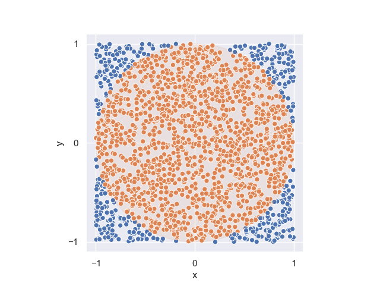

# pi-estimate

Estimate the value of Pi via different methods.

## Starting Point: Monte-Carlo Method

## Polygonal algorithm

Approximating the perimeter of the circle by the length of segments

### Equally spaced x

$$
P_{Circle} = 2\pi t \eq
$$

### Equally spaced $$\theta$$

Do not need to make a sum, just compute one and multiply by the number of segments.
But maybe assumed prior knowledge of $$\pi$$ when determining $$\theta?

## Infinite series

Viete, Wallis, Madhava-Gregory-Leibniz, Newton, Nilakantha

Computer era: inverse arctan series

## Iterative algorithms

Karatsuba algorithm, Tom-Cook multiplication, Fourier transform-based methods.

Arithmetic-geometric mean method (Gauss-Legendre algorithm)

## Chudnovsky algorithm

## To-do

* Deeper error vs number of points, save the data.
* Compare speed of different points generation method
