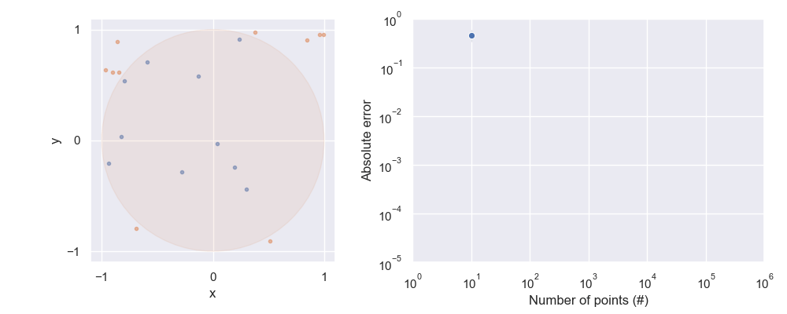
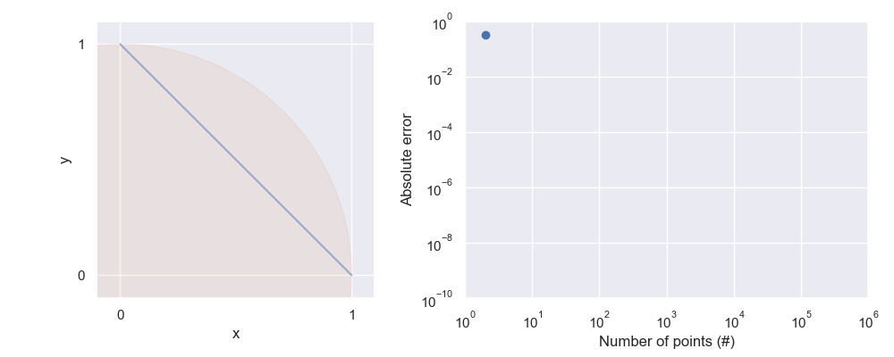

# pi-estimate

Estimate the value of Pi via different methods.

# Starting Point: Monte-Carlo Method

# Polygonal algorithms

## Arc length

Approximating the perimeter of the circle by the length of segments

## Archimedes

## Liu Hui

# Infinite series

Viete, Wallis, Madhava-Gregory-Leibniz, Newton, Nilakantha

Computer era: inverse arctan series

# Iterative algorithms

Karatsuba algorithm, Tom-Cook multiplication, Fourier transform-based methods.

Arithmetic-geometric mean method (Gauss-Legendre algorithm)

# Chudnovsky algorithm

# To-do

* More geometric methods
  * Polygon approximation (Archimedes) (perimeter)
  * [Liu Hui](https://en.wikipedia.org/wiki/Liu_Hui%27s_%CF%80_algorithm) (area)
  * Is my arc length version m

* Deeper error vs number of points, save the data.
* Compare speed of different points generation method
